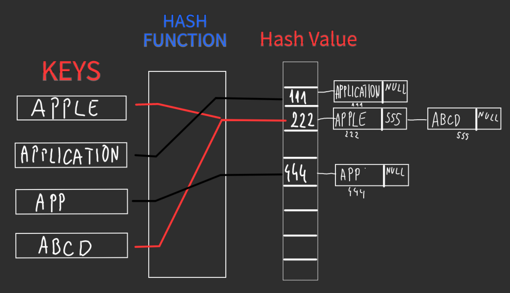
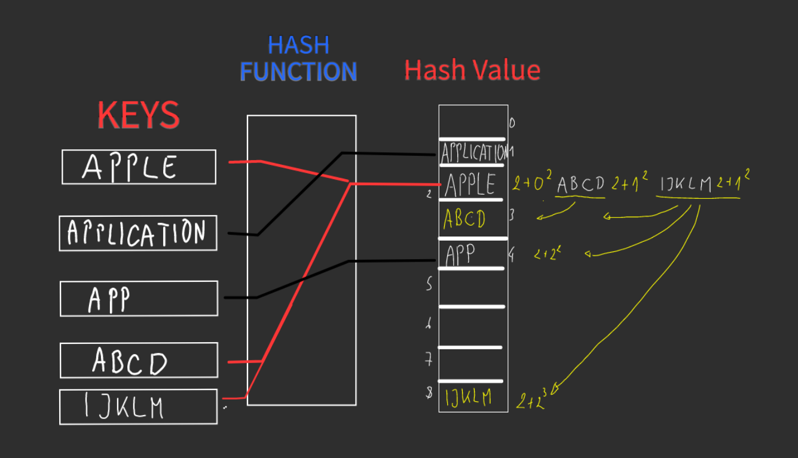
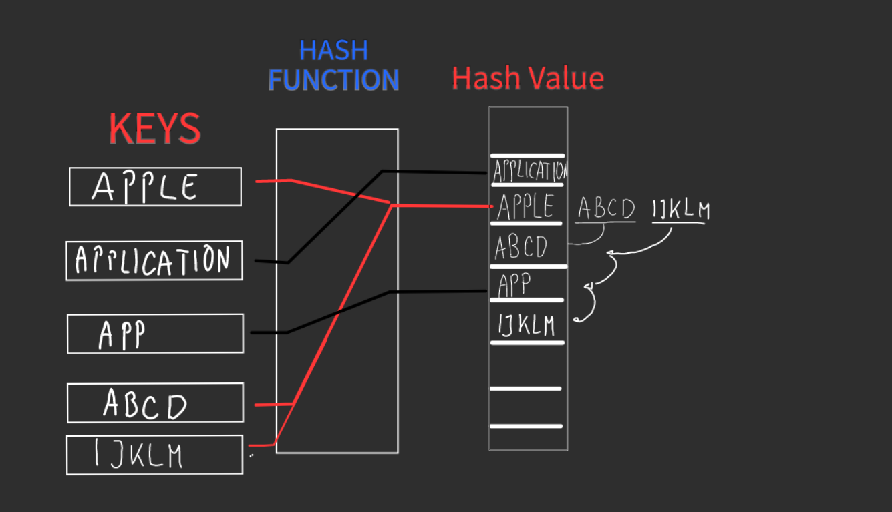

# 
Hashing

                                     Hashing is a method of sorting and indexing data. The idea behind hashing is 
                                     to allow large amounts of data to be indexed using keys commonly created by formulas

<table style="width: 100%">
<tr>
<th>Time efficient in case of search operation</th>
<th>Terminology</th>
</tr>
<tr>
<td>

| Data Structure | Time complexity for Search |
|----------------|----------------------------|
| Array          | O(logN)                    |
| Linked List    | O(N)                       |
| Tree           | O(logN)                    |
| Hashing        | O(1)/O(N)                  |

</td>
<td>
<ul>
<li>Hash function : It is a function that can be used to map of arbitrary size </li> 
  to data of fixed size
 <li>Key : Input data by user</li>
 <li>Hash value: A value that is returned by Hash Function</li>
 <li>Hash Table : It is a data structure which implements an associative array abstract data type, a structure that can map keys to value</li>
 <li>Collision : a collision occurs when two different keys produce the same output from hash function</li>
</ul>
</td>
</tr>
</table>

# 
Separate Chaining

|                                 |                                                                                                                                                                                   |
|---------------------------------|-----------------------------------------------------------------------------------------------------------------------------------------------------------------------------------|
|  | <ul><li>Implements the buckets as linked list. Colliding elements are stored in this list.</li><li>[SeparateChaining.java](SeparateChaining.java)</li></ul> |

# 
Quadratic Probing

|                              |                                                                                                                                                          |
|------------------------------|----------------------------------------------------------------------------------------------------------------------------------------------------------|
|  | <ul><li>Adding arbitrary quadratic polynomial to the index until an empty cell is found</li><li>[QuadraticProbing.java](QuadraticProbing.java)</li></ul> |

# 
Linear Probing

|                              |                                                                                                                                                                                                                       |
|------------------------------|-----------------------------------------------------------------------------------------------------------------------------------------------------------------------------------------------------------------------|
|  | <ul><li>Due to collision of keys while inserting elements into the hash table, idea of Linear Probing is used to probe the through the subsequent elements</li><li>[LinearProbing.java](LinearProbing.java)</li></ul> |

# 
Double Hashing

|                             |                                                                                                                                 |
|-----------------------------|---------------------------------------------------------------------------------------------------------------------------------|
|  | <ul><li>Interval between probes is computed by another hash function</li><li>[DoubleHashing.java](DoubleHashing.java)</li></ul> |

