# 
TREE

        In computer science, a tree is a widely used abstract data type that represents a hierarchical tree structure
        with a set of connected nodes. Each node in the tree can be connected to many children (depending on the type of tree),
        but must be connected to exactly one parent, except for the root node, which has no parent. 
        
        - Quicker and easier access to a data than linear(O(N))
        - Store hierarchical data like folder structure
        - Many different types of data structures which performs better in various situations

## Tree types

- [BINARY TREE](#binary-tree) [[(ARRAY) src](binary/BinaryTreeArray.java)] [[(Linked List) src](binary/BinaryTreeLinkedList.java)]
    - [BINARY SEARCH TREE](#center-binary-search-tree-center) [[src](binary/bst/BST.java)]
    - [AVL TREE](#center-avl-tree-center) [[src](binary/avl/AVL.java)]
    - [RED BLACK TREE](rbt) [[src](binary/bst/BST.java)]
    - [BINARY HEAP](#center-binary-heap-center) [[src](binary/binaryheap/BinaryHeap.java)]
- [TRIE](#center-trie-center) [[src](trie/Trie.java)]

## Tree terminology

  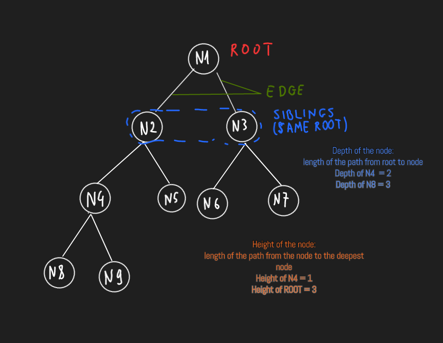

[Tree example](TreeNode.java)

# Binary Tree

    - Each node at most have 2 children
    - Family of data structure -> BinaryHeap, Binary Search Tree, AVL tree
    - Many problem can be solved using Binary Tree

## Types of Binary Tree

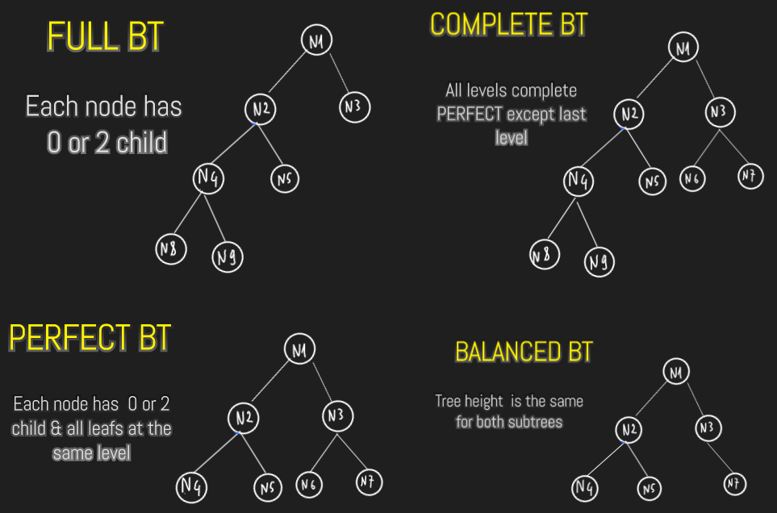

## Traverse

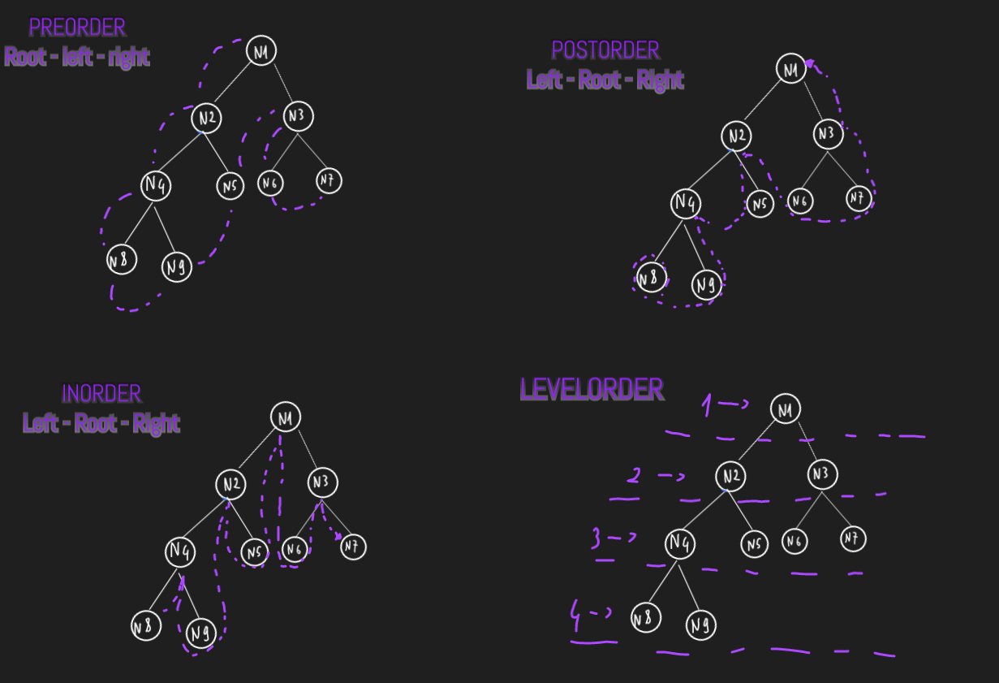

| ARRAY                           | LINKED LIST                     |
|---------------------------------|---------------------------------|
| 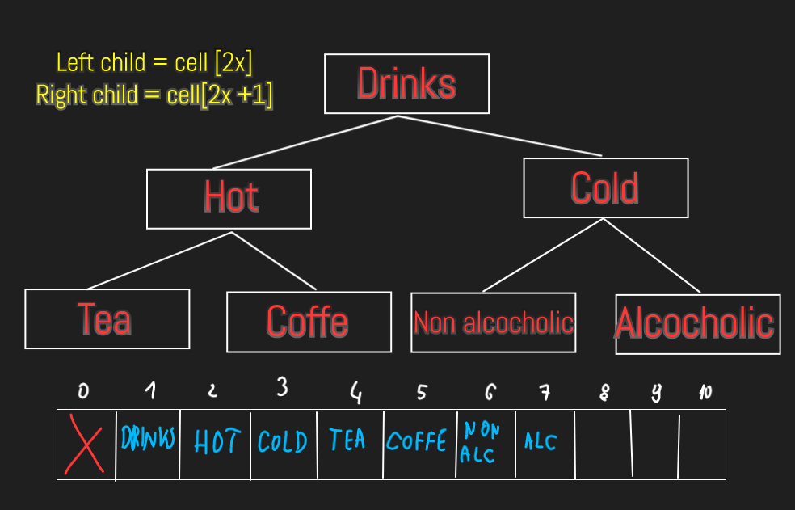 | 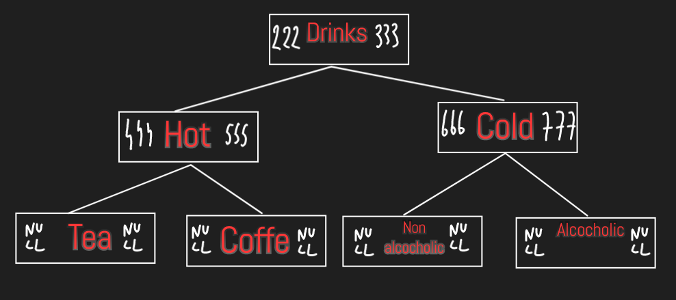 |

<table>
<tr>
</tr>
<tr>
<td>
<pre>

| ARRAY                 | Time Complexity[] | Space Complexity[] | 
|-----------------------|-------------------|--------------------|
| Create BT             | O(1)              | O(N)               | 
| Insert node to BT     | O(1)              | O(1)               | 
| Delete a node from BT | O(N)              | O(1)               | 
| Search for node in BT | O(N)              | O(1)               | 
| Traverse BT           | O(N)              | O(1)               | 
| Delete entire BT      | O(1)              | O(1)               | 
| Space Efficient?      | NO                | NO                 |

</pre>
</td>
<td>
<pre>

| LINKED LIST           | Time Complexity[] | Space Complexity[] | 
|-----------------------|-------------------|--------------------|
| Create BT             | O(1)              | O(1)               | 
| Insert node to BT     | O(N)              | O(N)               | 
| Delete a node from BT | O(N)              | O(N)               | 
| Search for node in BT | O(N)              | O(N)               | 
| Traverse BT           | O(N)              | O(N)               | 
| Delete entire BT      | O(1)              | O(1)               | 
| Space Efficient?      | NO                | NO                 |

</pre>

</td>
</tr>
</table>

# 
Binary Search Tree

     - Value of the left subtree root node is less than or equal to it's parent node's value
     - In the right subtree the value of a root node is greater than it's parent node's value
     - BST implement with Linked List

    - Performs faster and more efficient than BinaryTree when inserting, searching and deleting node (better time & space)

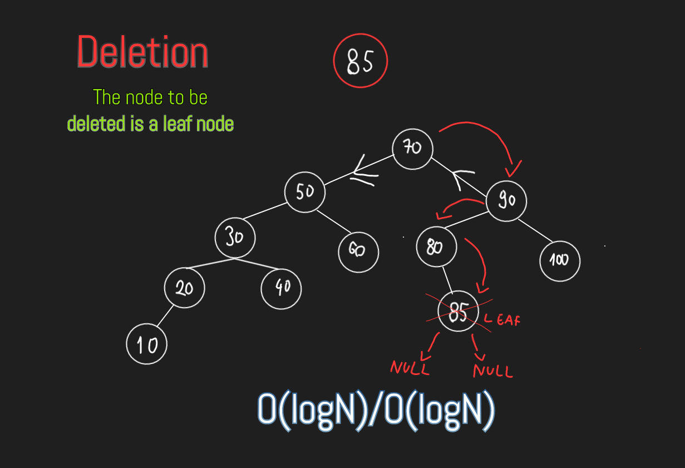
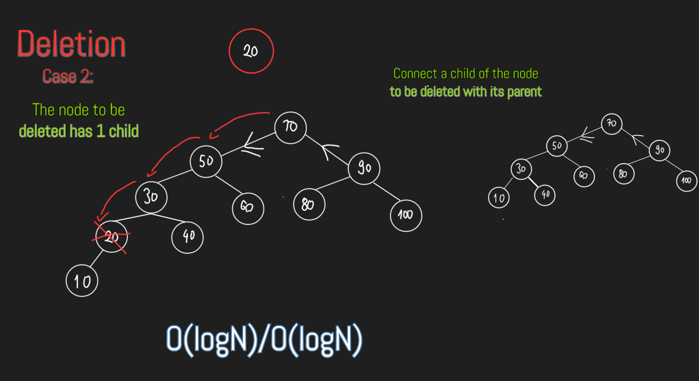
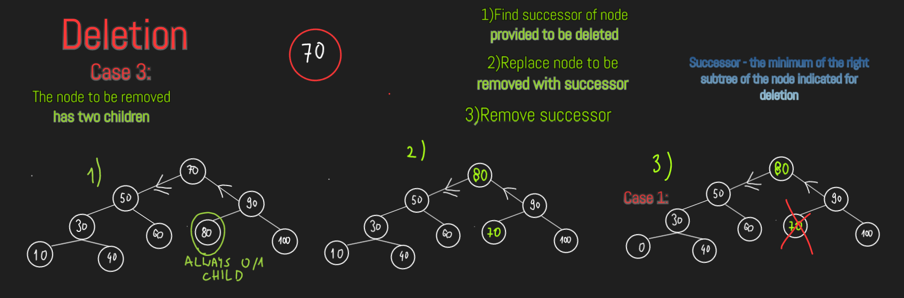
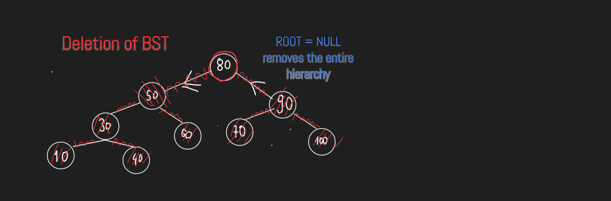
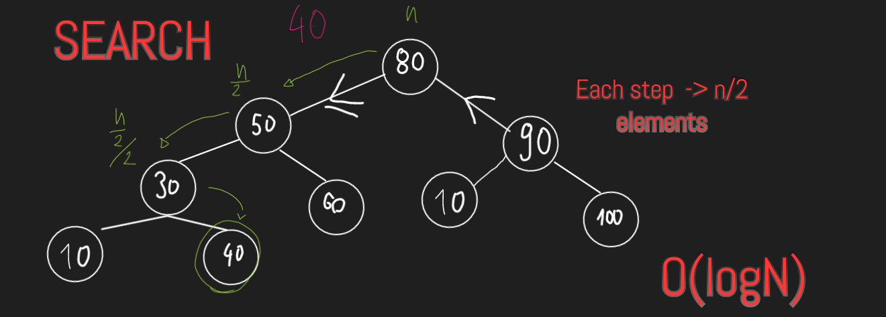

## Limitation

- BST might lead to O(N) time complexity for add/delete/search methods
  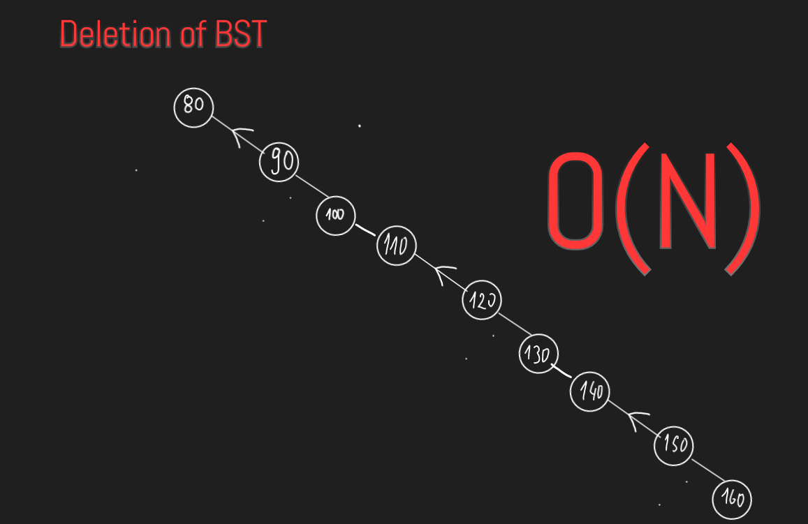

# 
AVL TREE

      AVL TREE - self-balancing BST where the difference between height of left and right subtrees cannot be more than one
      for all nodes

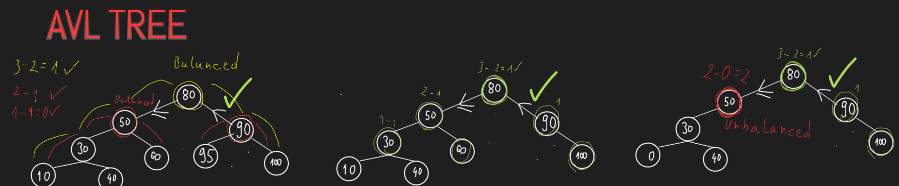

    If any time difference between height of left and right subtree differ by ore than one, then rebalancing is done to
    restore AVL property(balanced), by rotation
    With balancing algorithms we keep O(logN) time complexity for insert/delete/search 

#### Insertion

- Rotation is not required
  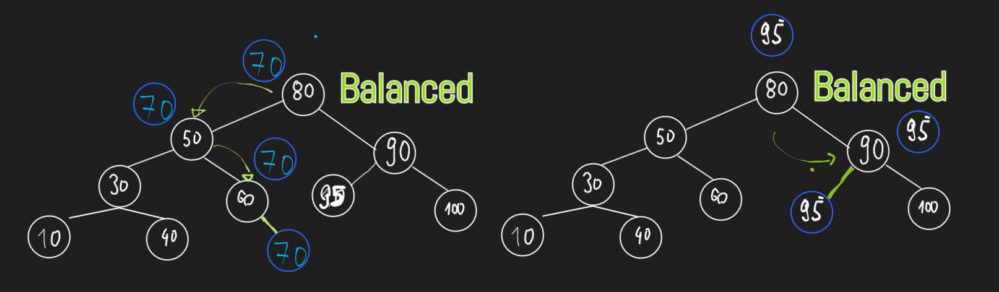
- Rotation is required

| LL CONDITION                                                                                                                                                                                                                                                            | RR CONDITION                                                                                                                                                                                                                                                        |
|-------------------------------------------------------------------------------------------------------------------------------------------------------------------------------------------------------------------------------------------------------------------------|---------------------------------------------------------------------------------------------------------------------------------------------------------------------------------------------------------------------------------------------------------------------|
| 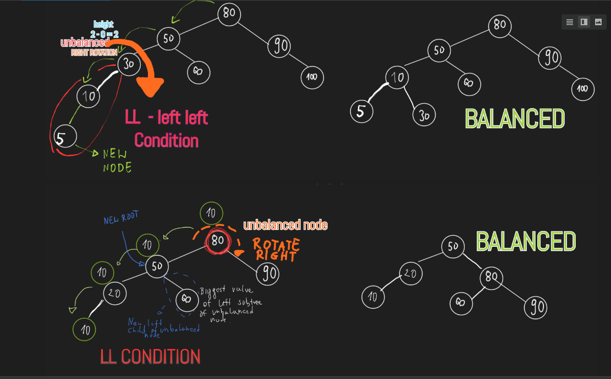                                                                                                                                                                                                                                            | 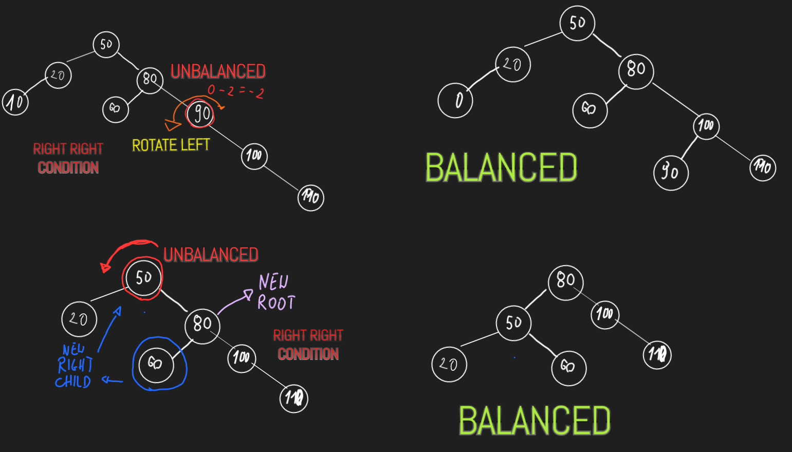                                                                                                                                                                                                                                   |
| rotateRight(disbalancedNode)  {    newRoot = disbalancedNode.leftChild disbalancedNode.leftChild = disbalancedNode.leftChild.rightChild newRoot.rightChild = disbalancedNode update height of disbalancedNode and newRoot return newRoot  } | rotateLeft(disbalancedNode)  { newRoot = disbalancedNode.rightChild disbalancedNode.rightChild = disbalancedNode.rightChild.leftChild newRoot.leftChild = disbalancedNode update height of disbalancedNode and newRoot return newRoot } |

| LR CONDITION                    | RL CONDITION                    |
|---------------------------------|---------------------------------|
|  |  |
|                                 |                                 |       

#### Deletion

- Delete a node
    - Case 1: Rotation is not required
        - 
        - 
        - 

    - Case 2: Rotation is required
        - 
        - 
        - 

- Delete the entire AVL tree
    - 

#### Search

# 
 Trie 

        a tree data structure used for locating specific keys from within a set. These keys are most often strings,
        with links between nodes defined not by the entire key, but by individual characters.

> - Any node in trie can store non-repetitive multiple characters
    >
- Every node stores link of the next character of the string
>   - Every node keeps track of end of string
>   - **Each node has HashMap with pairs of character and link to the next character**

#### Insertion

#### Deletion

#### Use case

# 
Binary Heap

    Binary Heap is a complete tree (all levels are completly filled except last level, and
    the last level has all keys as left as possible)
    
    BinaryHeap is eathier Min Heap or Max Heap. Key root must be minimum(min heap) or 
    maximum (max heap) among all keys present in tree.

> **Binary tree** with following proporties:
>  - It's either min heap(root must be minimum among all keys) or max heap
>  - It's complete tree(all level complete perfect except last level - **filled from left**)

## Why BH?

- Find the minimum or maximum number among set of numbers in logN time
- Make sure that inserting additional numbers does not take more than O(logN)

## Practical use

- Prim's Algorithm
- Heap Sort
- Priority Queue

## Types of Binary Heap

- **Min heap** - the value of each node is less than or equal to the value of both its children.
- **Max heap** - it is exactly the opposite of min heap that is the value of each node is more than or equal to the
  value of both its children.

## Array Implementation

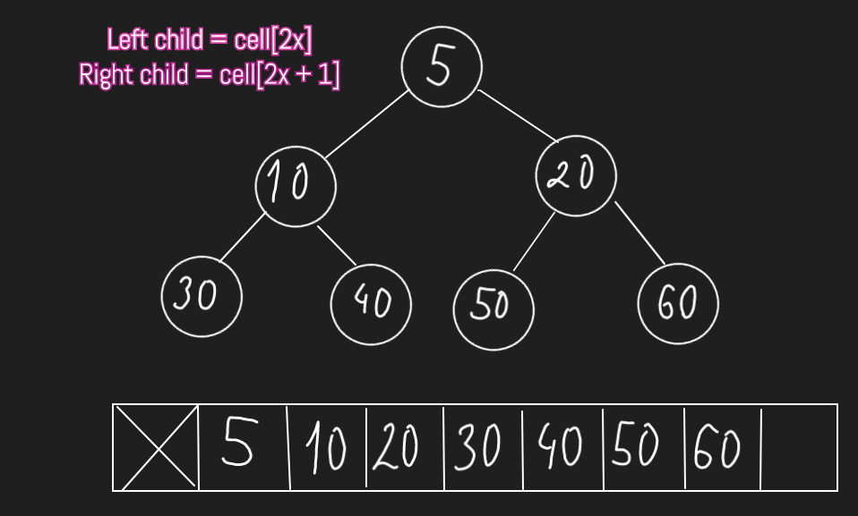

## Common operations on Binary Heap

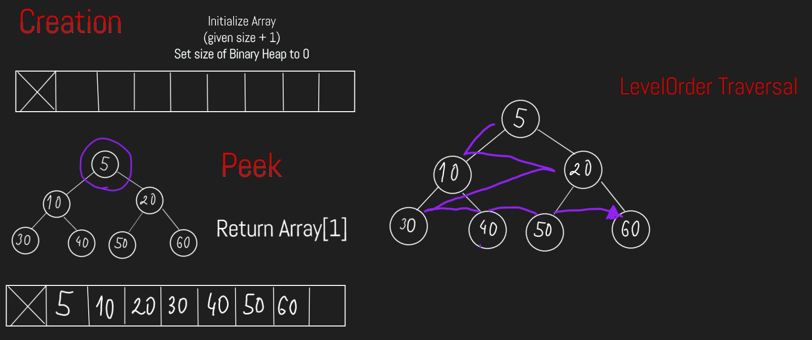
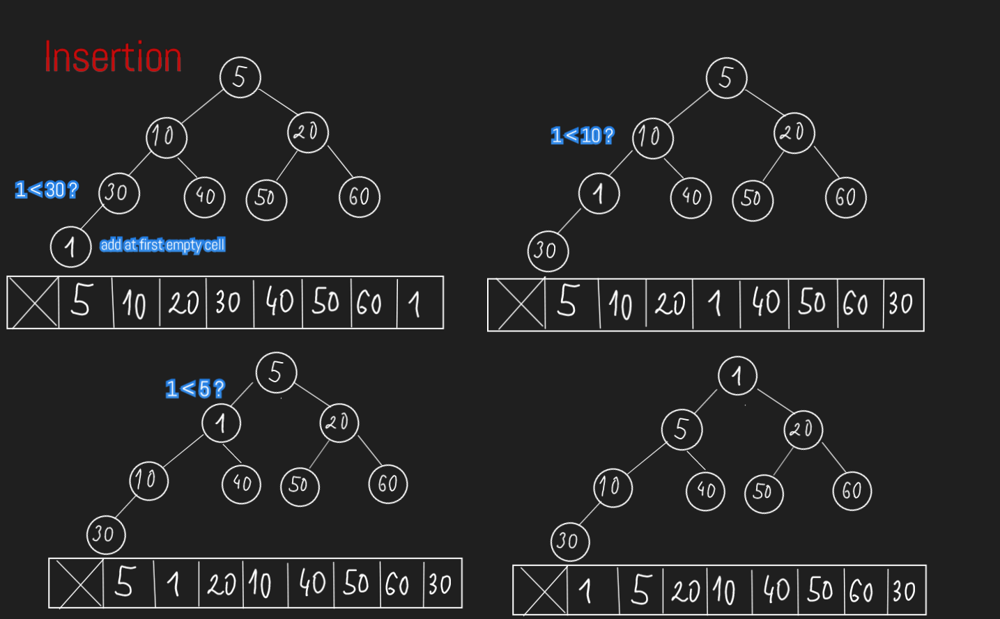
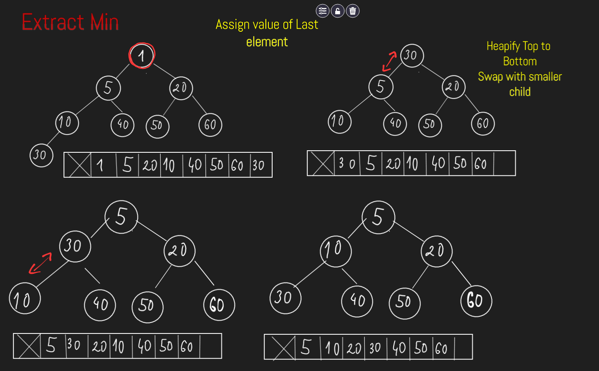

## Pseudocode

    arr[]
    size = 0;
    Create(capacity) {
        arr = new arr[capacity + 1] -- dont include size 0
    }

  

    isEmpty {
        return size == 0
    }
    Add(val) {
        if isFull()
            resize
        
        arr[++size] = val
        heapify(size)
    }
    
    heapifyBottomToTop(index) {
        parent = index / 2
        if index <= 1 
            return
        if arr[parent] > arr[index]  -- min heap
            swap(arr[parent], arr[index])
    }

    heapifyTopToBottom(index) {
        left = index * 2
        right = index * 2 + 1
        if left > size -- Base case
            return
        if size == left -- 1 child, right - OutOfBoundException
            minIndex = left
        else
            minIndex = arr[left] < arr[right] ? left : right
        if arr[index] > arr[minIndex]
            swap arr[index] arr[minIndex]
        heapifyTopToBottom(minIndex)
    }