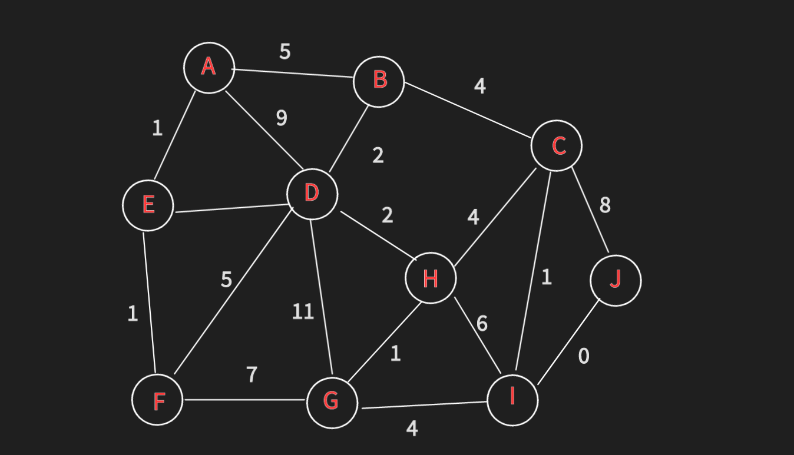
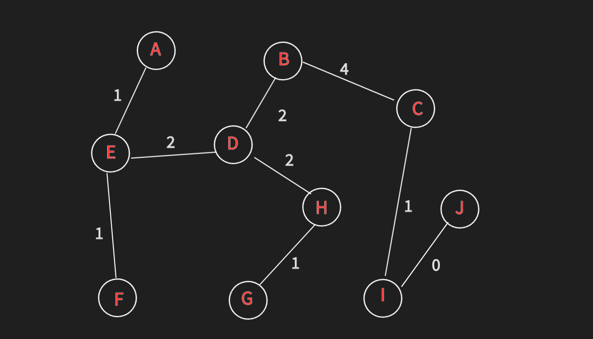

# Union Find

## What's Union Find?

> **Union Find** is a data structure that keeps track of elements which are split
> into one or more disjoint sets. Its has two primary operations: **find** and **union**

- Find - given an element the Union Find will tell you what group that element belongs to
- Union - merges two groups together

## When and where is a Union Find used?

- Kruskal's minimum spanning tree algorithm
- Grid percolation
- Network connectivity
- Least common ancestor in trees
- Image processing

## Complexity analysis

| Construction       |      |
|--------------------|------|
| Union              | O(N) |
| Find               | a(n) |
| Get component size | a(n) |
| Check if connected | a(n) |
| Count components   | O(1) |

- a(n) - amortized constant time - almost constant time although not quite constant time

## Kruskal's minimum spanning tree algorithm

> Given a graph G = (V, E) we want to find Minimum Spanning Tree in the graph (it may not be unique)
> A minimum spanning tree is a subset of the edges which connect all vertices in the graph with
> the minimal total edge cost

1) Sort edges by ascending edge weight.
2) Walk through the sorted edges and look at the edge belongs to,
   if the nodes are already unified we don't include this edge, otherwise
   we include it and unify the nodes.
3) The algorithm terminates when every edge has been processed or all the vertices have been unified.

- If node already belong to the same group then we want to ignore it because it'll create a cycle

## Creating Union Find

- To begin using Union Find, first construct a bijection (mapping) between your objects
  and the integers in the range [0, n) (n-number of elements)
    - Bijection - randomly assign a mapping between the objects and the integers
- Allow us to construct an array-based union find
- Store Union Find information in an array. Each index has an associated object.

## Find & Union Operation

- Find - find the root of the component to knew to which component element belongs.
  Follow the parent nodes until a self loop is reached(a node who's parent is itself)
- Union - to unify two elements find which are the root nodes of each component and if the
  root nodes are different make one of the root nodes be the parent of the other(merge smaller component to bigger one)

The Number of components is equal to the number of roots remaining. Also, number of roots nodes never increases

## Union Find Path Compression

When you have to merge two components, before doing so -
Find the root of the component and then set each node to the same parent

**Path compression making Union Find data structure very efficient**

---
resource: https://www.youtube.com/watch?v=ibjEGG7ylHk&list=PLDV1Zeh2NRsBI1C-mR6ZhHTyfoEJWlxvq&index=1