# 
Graph

> Graph consist of a finite set of Vertices(nodes) and a set of Edges which connect a pair of nodes
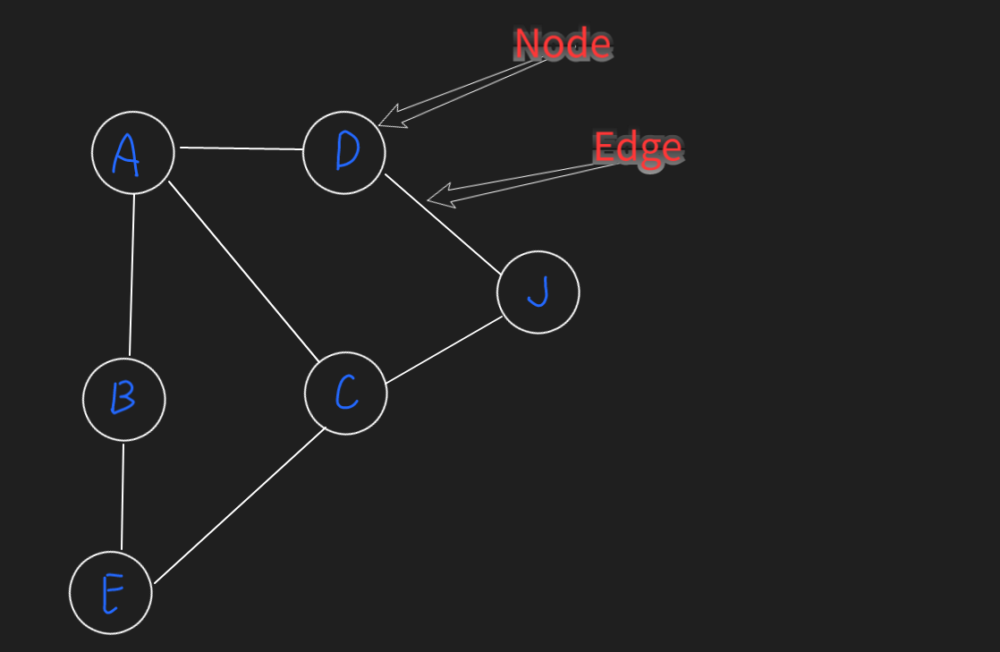

## Graph Terminology

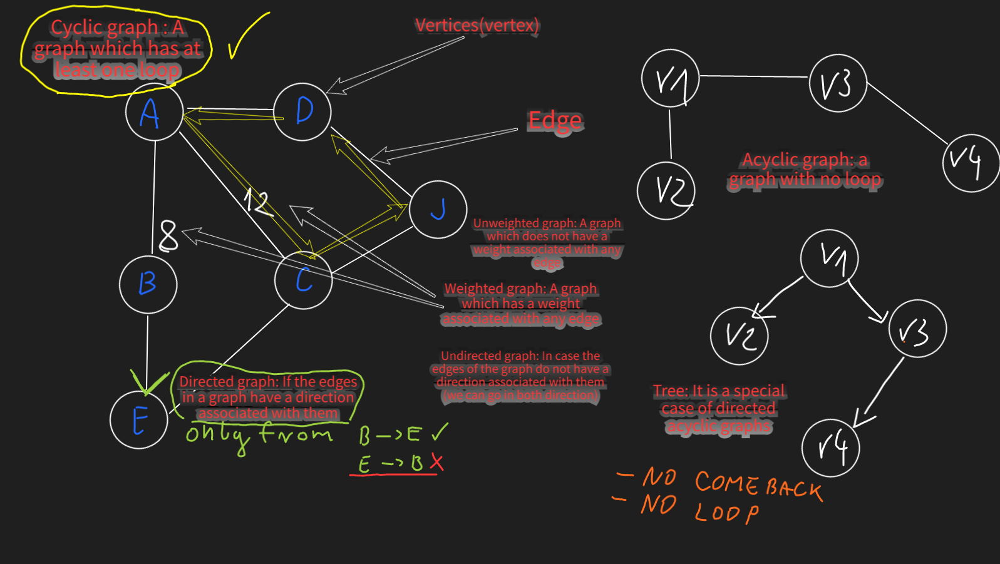

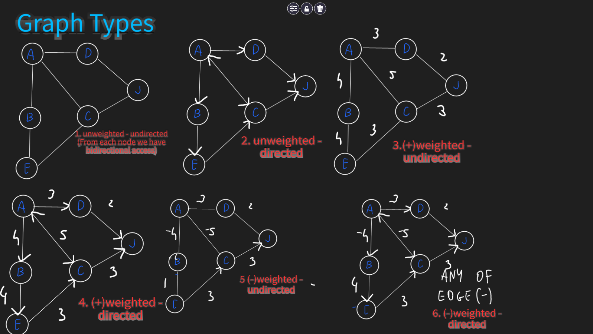

## Graph Representation

- [**Adjacency Matrix**](matrix/GraphMatrix.java)  : an adjacency matrix is a square matrix. And the elements of the
  matrix indicate whether pairs of vertices are adjacent or not in the graph
    - Use when a graph is complete or almost complete(all nodes has edge to each other), else it's not space efficient!
- [**Adjacency List**](list/GraphList.java) : an adjacency list is a collection of unordered list used to
  represent a graph. Each list describes the set of neighbors of a vertex in the graph
    - If the number of edges are few then we should use Adjacency List(Matrix is not optimal, because most of the cells
      will be empty)
      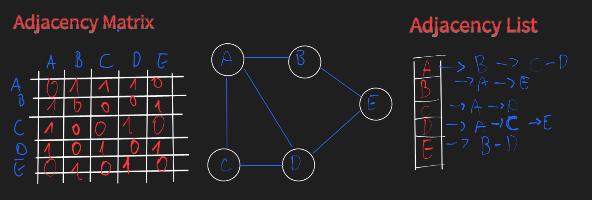

## Breadth-First Search [list](list/BreadthFirstSearch.java) [matrix](matrix/BreadthFirstSearch.java)

- The **Breadth-First Search** is algorithm used to explore nodes and edges of a graph.
  It run with time complexity of O(V+E)(vertices + Edges) / space complexity O(V+E) and is often used as building block
  in other algorithms
- Undirected/Directed unweighted graphs
- The BFS algorithm is particular useful for one thing: finding the shortest path on unweighted graphs
- First visit the closest vertices
  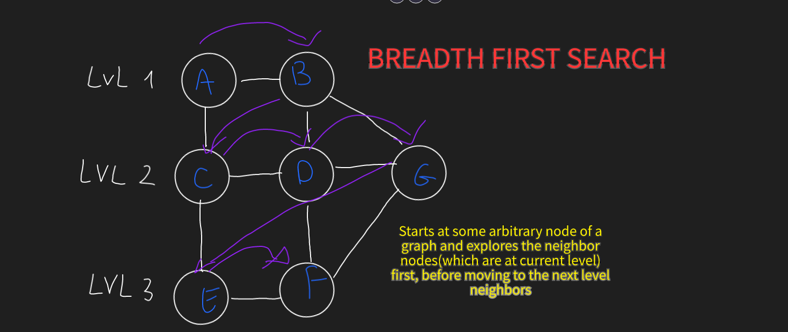

        BFS uses a queue data structure to track which node is visited next.

## Depth-First Search [list/stack](list/DepthFirstSearchStack.java) [list/recursive](list/DepthFirstSearchRecursive.java) [matrix/stack](matrix/DepthFirstSearchRecursive.java)

- The **Depth First Search** is the most fundamental search algorithm used to explore nodes and edges of a graph.
- It runs with a time complexity O(V+E) and is often used as a building block in other algorithms
- Directed or undirected edges

As the name suggests, a DFS plunges depth first into a graph without regard for which edge it takes next until it
cannot go any further at which point it backtracks and continues.

## BFS vs DFS

|                             | BFS                                                       | DFS                                                           |
|-----------------------------|-----------------------------------------------------------|---------------------------------------------------------------|
| Internally                  | It goes in breath first                                   | it goes in depth first                                        |
| what ds does use internally | Queue                                                     | Stack  /  Recursive                                           |
| Time complexity             | O(V+E)                                                    | O(V+E)                                                        |y
| Space complexity            | O(V+E)                                                    | O(V+E)                                                        |
| When to use                 | If we know that the target is close to the starting point | If we already know that the target vertex is buried very deep |

## Topological Sort

> - ([TS/MATRIX](matrix/GraphMatrix.java))  ([TS/LIST](list/GraphList.java))

- Directed acyclic graphs
    - graph which contain a cycle cannot have topological ordering
    - valid topological ordering only for Directed Acyclic Graph
- Sorts given actions in such a way that if there is a dependency of one action on another, then the dependent action
  always comes later than its parent action (identify order of task) (arrows indicated dependencies)
  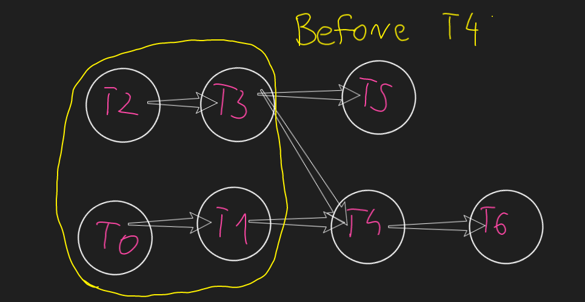
  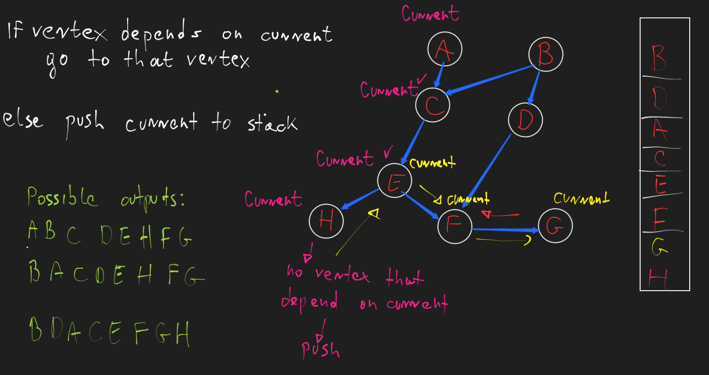
- Topological ordering is an ordering of the nodes in a directed graph where for each directed edge from
  node A to node B, node A appears before node B in the ordering.
- Topological sort algorithm can find a topological ordering in O(V+E) time!
- All root trees have a topological ordering since they do not contain any cycle

> We dont traverse through all edges for each vertex's, only for unvisited,
> We are looping through all vertex's to make sure that each one was visited

| Time Complexity | Space Complexity |
|-----------------|------------------|
| O(V+E)          | O(V+E)           |

## Single Source Shortest Path Problem

> Finding a path between a given vertex(called source) to all other vertices in a graph
> such that the total distance between them (source and destination) is minimum

The Problem:

- Five destination in different cities.
- Travel cost between cities are known
- Find the cheapest way from prime destination to desired destination

## BFS

- Only for unweighted graphs
- 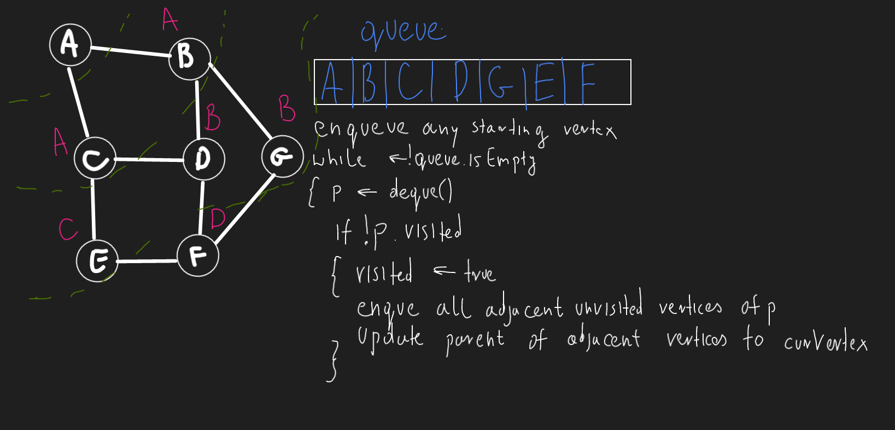
- **Time: O(E)(E=VERTEX*NEIGHBORS) / Space:O(V)**
- 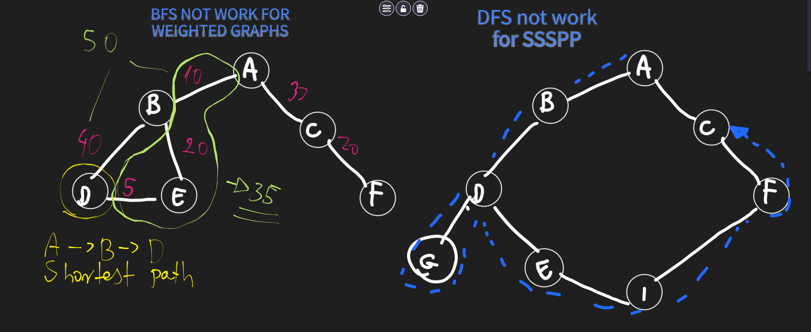- Do not work with weighted graphs (BFS - might ignore some edges!)

## Dijkstra Algorithm

- [LAZY](list/LazyDijkstra.java)
- [EAGER](list/EagerDijkstra.java)

  Single source shortest path algorithm for weighted graphs with no negative cycle.
  Ensure that once a node has been visited its optimal distance cannot be improved
  Dijkstra's fails for negative values - It happens because, in each iteration, the algorithm only updates the
  answer for the nodes in the queue, does not reconsider a node once it marks it as visited even if a shorter path
  exists than the previous one.

> **Algorithm overview**
> - Maintain a 'dist' array where the distance to every node is positive infinity. Mark the
    >   distance to the start node 's' to be 0
> - Maintain a PQ of key-value pairs of (node index,distance) pairs which tell you which
    >   node to visit next based on sorted min(distance) value
> - Insert (s,0) into the PQ and loop while PQ is not empty pulling out the next most
    >   promising (node index, distance) pair
> - Iterate over all edges outward from the current node and relax each edge appending a
    >   new (node index, distance) key-value pair to the PQ for every relaxation.

Lazy implementation of Dijkstra insert duplicate key-value pairs (keys - node index, value - candidate for shortest
distance)
in our PQ because it's more efficient to insert a new key-value pair in O(log(N)) than it is to update and existing
key's value in O(N) (requires searching)

This apporach is inefficient for dense graphs because we end up with several stale outdated key-value pairs
in our PQ. The eager version of Dijkstra's avoid duplicate key-value pairs and supports efficient value updated
in O(log(N)) by using Indexed Priority Queue (IPQ)

## [Bellman Ford Algorithm(adjacency list)](list/BellmanFordAdjacencyList.java) [Bellman Ford Algorithm(edge list)](list/BellmanFordEdgeList.java)

    Algorithm to find the shortest path. If there's negative cycle it catches it and report existence of it.
    We can only report negative cycle, cannot find the shortest path in case of negative cycle

| Graph Type                       | BFS | Dijkstra | Bellman Ford |
|----------------------------------|-----|----------|--------------|
| Unweighted - undirected          | OK  | OK       | OK           |
| Unweighted - directed            | OK  | OK       | OK           |
| Positive - weighted - undirected | X   | OK       | OK           |
| Positive - weighted - directed   | X   | OK       | OK           |
| Negative - weighted - undirected | X   | NO       | OK           |           
| Negative - weighted - directed   | X   | NO       | OK           |
| Negative Cycles                  | X   | X        | OK           |

|                  | BFS                                                 | DIJKSTRA                               | BELLMAN FORD                      |
|------------------|-----------------------------------------------------|----------------------------------------|-----------------------------------|
| Time complexity  | O(V^2)                                              | O(V^2)                                 | O(VE) O(V^3) -> complete graph    |
| Space complexity | O(E)                                                | O(V)                                   | O(V)                              |
| Implementation   | easy                                                | moderate                               | moderate                          |
| Limitation       | (X)weighted graphs                                  | (X)weighted graphs                     | -                                 |
| Unweighted graph | (OK)(Time complexity is fine and easy to implement) | (OK) (moderate to implement)           | (OK)(time complexity is bad)      |
| Weighted graph   | (X)                                                 | Time complexity is better than Bellman | Not use as time complexity is bad |
| Negative cycle   | (X)                                                 | (X)                                    | Use this as others not support    |

## **All pair shortest path problem**

      about finding a path between every vertex to all other vertices(not only to given vertex) in a graph such that the
      total distance between them(source and destination) is minimum
      One way to solve this assignment might be to run algorithm to fing the shortest path for each vertex as source

## [Floyd Warshall Algorithm](matrix/FloydWarshall.java)

- Directed weighted graphs
- algorithm is an **All-Pairs Shortest Path algorithm**.
- Find the shortest path between all pairs of nodes
- Loop through all vertices in each iteration (for each vertex consider all edges)
- Support positive or negative edges (no negative cycle!)
- O(V^3)

- With FW, the optimal way to represent our graph is with a 2D adjacency matrix m where
  cell m[i][j] represents the edge weight of going from node i to node j
- If there is no edge from node i to node j then set the edge value for m[i][j] to be positive infinity
- !!!If programming language does not support a special constant for +oo such that oo+oo = oo then we must avoid
  using max values for our types. That will cause integer overflow!!!

The main idea behind the Floyd-Warshall algorithm is to gradually **build up all
intermediate routes between nodes i and j** to find the optimal path

# Kruskal's minimum spanning tree algorithm

Given a graph G = (V, E) we want to find Minimum Spanning Tree in the graph (it may not be unique) A minimum spanning
tree is a subset of the edges which connect all vertices in the graph with the minimal total edge cost

- Sort edges by ascending edge weight.
- Walk through the sorted edges and look at the edge belongs to, if the nodes are already unified we don't include this
edge, otherwise we include it and unify the nodes.
- The algorithm terminates when every edge has been processed or all the vertices have been unified.
If node already belong to the same group then we want to ignore it because it'll create a cycle

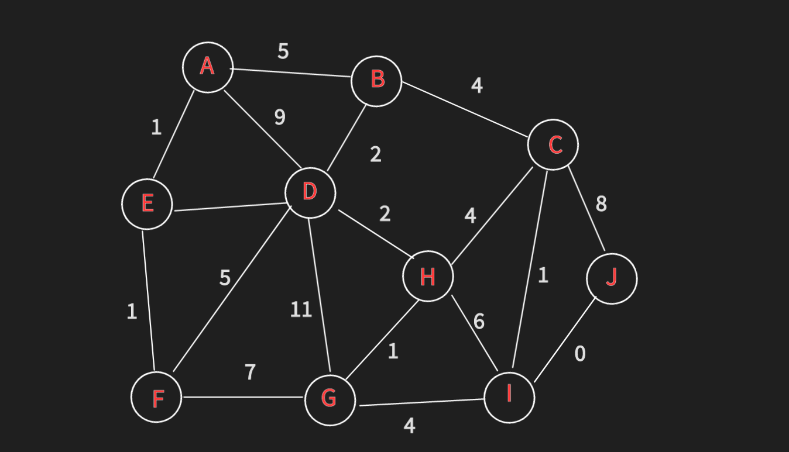
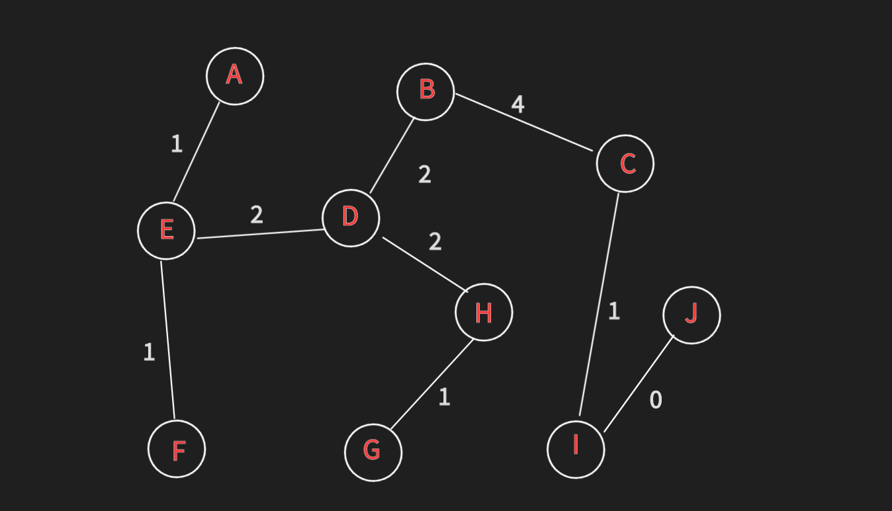

Kruskal's algorithm finds a minimum spanning forest of an undirected edge-weighted graph.
