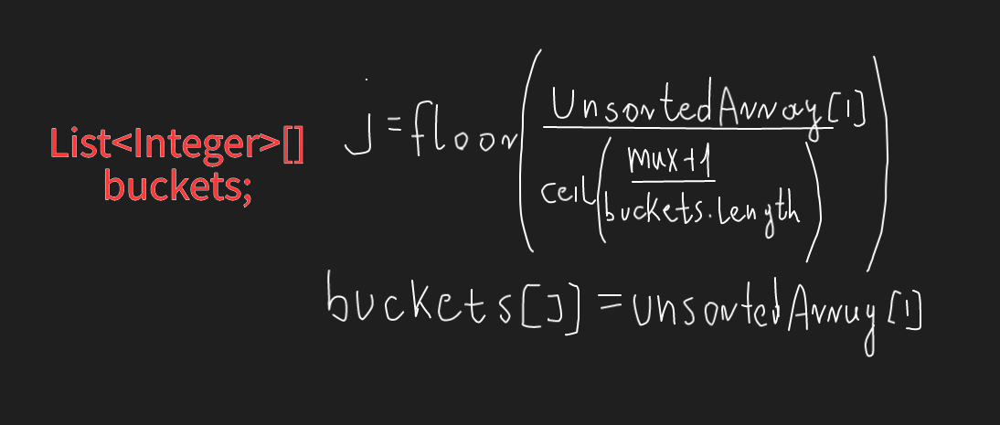
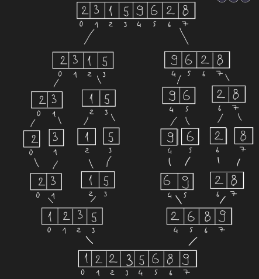
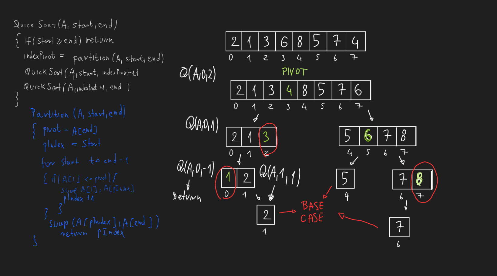

# 
Sorting

                                              arranging data in a particular format : either ascending or descending

## Types of sorting:

- **Space used**
    - In place
    - Out of place
- **Stability**
    - Stable
    - Unstable

## Stability

- **Stable sorting:** if a sorting algorithm after sorting the contents does not change the sequence of similar content
  in which tey appear, then this sorting is called stable sorting
- **UnStable sorting:** If a sorting algorithm after sorting the content changes the sequence of similar content in
  which they appear, then it is called unstable sort.

- [BUBBLE SORT](BubbleSort.java)
  > - Repeatedly compare each pair of adjacent items and swap then if they are in the wrong order
  > - Stable
  > - In place
  > - time complexity O(N^2)
- [SELECTION SORT](SelectionSort.java)
  > - Selection sort works by finding the minimum element and then inserting it in its correct position by swapping with
      the element which is in the position of this minimum element.
  > - Divide the given array into two parts
  > - Not stable
  > - time complexity O(N^2)
- [INSERTION SORT](InsertionSort.java)
  > - Divide the given array into two parts
  > - Take first element from unsorted array and find its correct position in sorted array
  > - Repeat until unsorted array is empty
  > - time complexity O(N^2)

- [BUCKET SORT](BucketSort.java)
  > - Create Buckets and distribute elements of array into buckets
  > - Sort buckets individually
  > - Merge buckets after sorting
  > - Stable / Not Stable
  > - Not space efficient, not in place sort
  > - 
- [MERGE SORT](MergeSort.java)
  > - Merge sort is a divide and conquer algorithm
    - Divide the input array in two halves and we keep halving recursively until they become too small that cannot be
      broken further (base case)
  > - Merge halves by sorting them
      >
  - 

      Pseudocode
      A - array
      N - array.length
      MergeSort(A)
      {
        mid = N/2;
        if N < 2 return
        left = new array[mid]
        right = new array[size - mid]
        for i = 0 i < mid i ++
          left[i] = A[i]
        for i = mid i < N i++
          right[i - mid] = A[i]
        MergeSort(left)
        MergeSort(right)
        Merge(left,right,A)
      }
      
      Merge(left,right,A)
      {
        int k = 0;
        int i = 0;
        int j = 0;
        while(i < left.length && j < right.length) 
        {
          if left[i] <= left[j]
            A[k++] = left[i++]
          else 
            A[k++] = right[j++]
        }

        while(i < left.length) 
          A[k++] = left[i++]
        
        while(j < right.length)
          A[k++] = right[j++]
        
      }

- [QUICK SORT](QuickSort.java)
  > - Quick sort is a divide and conquer algorithm
  > - Find pivot number and make sure smaller numbers located at the left of pivot and bigger number are located at the
      right of the pivot
  > - Unlike merge sort extra space is not required
  > - 
  > - Average - O(nlogN) time complexity
  > - Worst - O(N^2)!
      >
    - If the pivot is chosen in the worst way each time, instead of partitioning array into two list of size
      > n/2, it will partition into one of size 1 and one of size n-1. This lead to a recursion depth of n. Time
      > complexity is O(N^2)
  > - space complexity - O(nlog(n))
  > - Not stable
- [HEAP SORT](HeapSort.java)
    - Step 1: Insert data to Binary Heap Tree
    - Step 2: Extract data from Binary Heap

## Comparison

| Name           | Time Complexity | Space Complexity | Stable |
|----------------|-----------------|------------------|--------|
| Bubble Sort    | O(N^2)          | O(1)             | YES    |
| Selection Sort | O(N^2)          | O(1)             | NO     |
| Insertion Sort | O(N^2)          | O(1)             | YES    |
| Bucket Sort    | O(N^2)          | O(N)             | YES    |
| Merge Sort     | O(nlogN)        | O(N)             | YES    |
| Quick Sort     | O(N^2)          | O(nlogN)         | NO     |
| Heap Sort      | O(nlogN)        | O(1)             | NO     |
